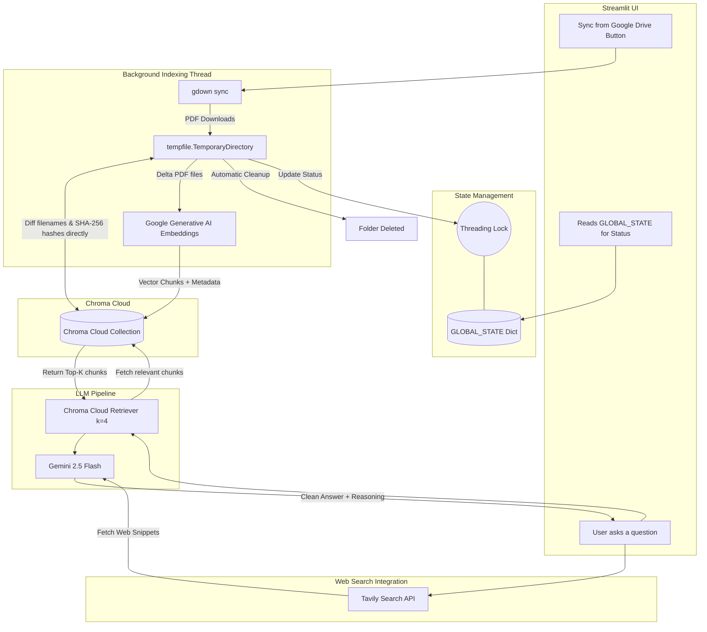
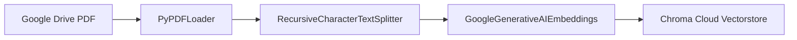
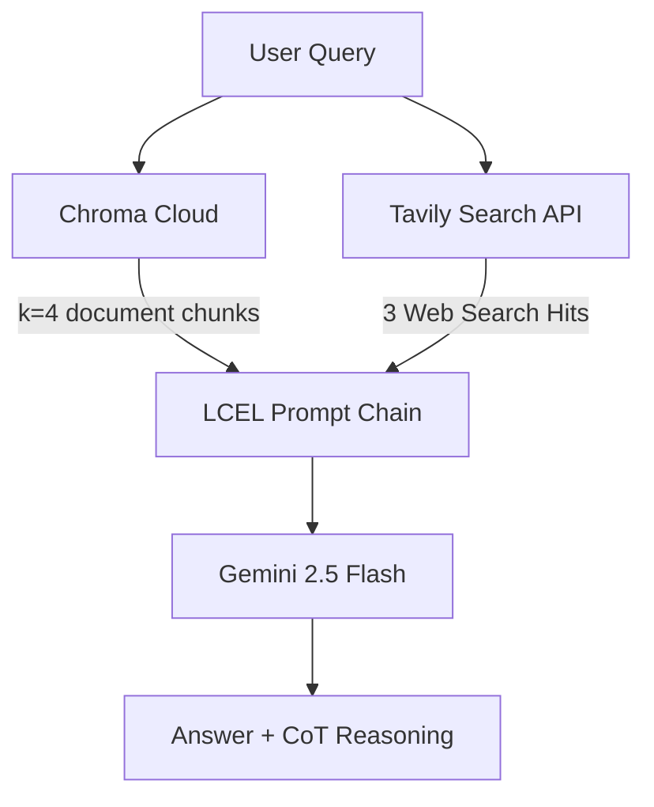

# Documind: MedStudy RAG Assistant

🚀 **Live Deployed App**: [ai-rag-app-ss.streamlit.app](https://ai-rag-app-ss.streamlit.app/)

Documind is a high-performance, cloud-backed Retrieval-Augmented Generation (RAG) study companion designed for medical students. It leverages Google Gemini, Chroma Cloud, and Tavily Web Search to answer complex medical questions. It prioritizes local PDF study materials and falls back to live web searches when necessary, complete with step-by-step chain-of-thought reasoning.

---

## 1. Architectural Diagram

Below is the high-level architecture showing how the Streamlit frontend, background threads, Chroma Cloud database, Tavily search, and the Gemini LLM interact:



---

## 2. Important Features & Background Flows

While the user interacts with a clean chat interface, several critical flows occur silently behind the scenes:

### Feature A: Stateless Incremental Indexing
Most basic RAG apps re-embed the entire directory every time indexing is triggered, wasting API tokens and execution time.
*   **Behind the scenes:** The database itself serves as the single source of truth. Document metadata (filenames and SHA-256 cryptographic hashes) are stored directly inside Chroma Cloud's chunk metadatas.
*   **The Flow:** When indexing runs, the PDFs are downloaded to a temporary directory. The app queries Chroma Cloud to get the currently indexed files and their SHA-256 hashes. If a file is deleted from Google Drive, it purges its vectors from Chroma Cloud. If a file is added or modified (even if the file size remains the same, any content change alters its SHA-256 signature), it embeds and uploads *only* that file, keeping the system clean and local-storage-free.

### Feature B: Thread-Safe State Management (Decoupled from Streamlit)
Streamlit's `st.session_state` is tied to specific browser session context (`ScriptRunContext`). A background thread attempting to update UI state would normally crash Streamlit.
*   **Behind the scenes:** The background indexing task never touches `st.session_state` directly.
*   **The Flow:** Instead, a module-level Python dictionary (`GLOBAL_STATE` in `rag_core.py`) is used, protected by a `threading.Lock()`. The background thread safely writes to this dictionary, and the Streamlit UI reads from it on every reload, providing live progress updates safely.

### Feature C: Context-Grounded Prompting with Web Fallback
Medical RAG systems must not guess answers if the information is missing from the uploaded guides.
*   **Behind the scenes:** The pipeline uses a strict Chain-of-Thought (CoT) and Few-Shot system prompt that merges local vector database results and live web search.
*   **The Flow:** Before outputting the final answer, the LLM is forced to output a `Reasoning:` block. This grounds the model in the context chunks retrieved by Chroma Cloud. It prioritizes local PDF materials; if information is only found via web search, it prefixes those points with `(Web)`. If neither contains the answer, the LLM outputs a clean refusal rather than fabricating medical advice.

---

## 3. Chroma Cloud and Google Drive Integration

*   **Google Drive Syncing**: Uses `gdown` to connect to a publicly shared Google Drive folder link without requiring OAuth configurations. The files are downloaded directly into a `tempfile.TemporaryDirectory()`, indexed, and automatically deleted, keeping local storage completely clean.
*   **Chroma Cloud (`CloudClient`)**: Connects to the serverless Chroma Cloud hosting using your account credentials (`CHROMA_TENANT` and `CHROMA_CLOUD_KEY`), avoiding local database storage overhead.

---

## 4. LangChain Pipeline & Data Structure

The application's core intelligence is built using LangChain components in `rag_core.py`. The pipelines are split into two flows: **Indexing** and **Retrieval/Generation (RAG)**:

### A. Indexing Pipeline (Data Ingestion)

*   **Document Loader**: `PyPDFLoader` is used to load and parse PDFs.
*   **Text Splitter**: `RecursiveCharacterTextSplitter` chunking:
    *   `chunk_size = 1000` characters.
    *   `chunk_overlap = 150` characters.
*   **Embeddings model**: `GoogleGenerativeAIEmbeddings` using `models/gemini-embedding-2` to embed text chunks into vectors.
*   **Vectorstore**: `Chroma` client using `chromadb.CloudClient` to upload chunks to Chroma Cloud.
    *   **Chunk Metadata Structure**:
        ```json
        {
          "source": "Cardiovascular_Physiology.pdf",
          "file_hash": "a3f124c8b9d5c8...",
          "page": 1
        }
        ```

### B. Retrieval & Generation Pipeline (RAG Query)

*   **Retriever**: `Chroma.as_retriever(search_kwargs={"k": 4})` (queries the top 4 most similar chunks using cosine similarity).
*   **Web Tool**: `TavilySearchResults(max_results=3)` (queries the internet for supplementary medical facts).
*   **LLM Model**: `ChatGoogleGenerativeAI` using `gemini-2.5-flash` with `temperature = 0.2` for grounded answers.
*   **LangChain Expression Language (LCEL) Chain**:
    ```python
    chain = prompt | llm | StrOutputParser()
    ```

---

## 5. UI Performance Enhancements

*   **@st.fragment Chat Section**: The entire chat UI is wrapped in a Streamlit fragment. When a user submits a message, only the chat section reruns instead of reloading the entire page, index status, or sidebar metrics, improving response times.
*   **Resource Pre-Warming**: LangChain embeddings, the Gemini LLM, and the Tavily client are pre-warmed on server startup using `@st.cache_resource`. This eliminates the "first-query delay" for users.

---

## 6. Testing & Quality Evaluation

The pipeline features two comprehensive test scripts to verify core system integrity:

### ROUGE-Score Evaluation (`test_app_rouge.py`)
To avoid heavier enterprise evaluation frameworks (like RAGAS or LangSmith), the project uses a lightweight functional test with the `rouge-score` library.
*   **Textual Overlap**: Measures ROUGE-1 and ROUGE-L (Longest Common Subsequence) recall and F1 overlap against a suite of hand-written reference answers mapping to the 5 medical PDF subjects.
*   **Refusal Validation**: Intentionally includes out-of-scope questions (e.g., *"What is a food allergy and how is it treated?"*) to ensure that the system refuses to answer and does not hallucinate, checking for phrases like *"insufficient"* or *"no relevant"*.
*   **Lenient Smoke Test**: Runs with a ROUGE-L F1 threshold of `0.28` to verify indexing, retrieval, and prompts are operational.

### Backend Pipeline Trial Run (`test_run.py`)
A fast script that programmatically runs the end-to-end sync, SHA-256 change detection, indexing, and test retrieval to check the active backend connection.

### Verification Results & Test Outputs
The indexing pipelines and document lifecycles were successfully run and verified. Below are the actual execution logs showing the indexing run and the subsequent SHA-256 skip checks working against the live Chroma Cloud instance:

#### 1. Sync & Indexing Trial Run Output (`test_run.py` - Initial Sync)
```text
[INDEXING] Starting sync for Google Drive folder ID: 1k9XaWHSBNbHbIXyZrstssumE1l9OG7Ap ...
[INDEXING] Downloading folder contents using gdown to temp directory...
[INDEXING] Google Drive folder contains 5 PDF(s).
[INDEXING] Fetching current database status from Chroma Cloud ...
[INDEXING] Chroma Cloud contains 5 indexed document(s).
[INDEXING] Detected new/modified PDFs: ['Cardiovascular_Physiology.pdf', 'Endocrine_Diabetes.pdf', 'Pharmacology_Antibiotics.pdf', 'Renal_Physiology_AcidBase.pdf', 'Respiratory_System.pdf']
[INDEXING] [CHROMA] Checking for stale database records to purge ...
[INDEXING] [CHROMA] Deleting 26 stale vector chunks ...
[INDEXING] [CHROMA] Purge complete.
[INDEXING] [PDF] Loaded 2 pages from Cardiovascular_Physiology.pdf.
[INDEXING] [CHROMA] Embedding and uploading 6 chunks to Chroma Cloud ...
[INDEXING] Finished incremental run. Total indexed docs: 5.
```

#### 2. Incremental Sync Verification (`test_run.py` - Skip Verification)
When run again immediately, the app detects that the SHA-256 checksums match the cloud database and finishes indexing instantly in milliseconds:
```text
[INDEXING] Starting sync for Google Drive folder ID: 1k9XaWHSBNbHbIXyZrstssumE1l9OG7Ap ...
[INDEXING] Downloading folder contents using gdown to temp directory...
[INDEXING] Google Drive folder contains 5 PDF(s).
[INDEXING] Fetching current database status from Chroma Cloud ...
[INDEXING] Chroma Cloud contains 5 indexed document(s).
[INDEXING] Finished incremental run. Total indexed docs: 5.
```

---

## 7. Local Development Setup

### Installation
1.  Create and activate a Python virtual environment:
    ```bash
    python -m venv venv
    .\venv\Scripts\activate
    ```
2.  Install dependencies:
    ```bash
    pip install -r requirements.txt
    ```

### Configuration
Create a `.env` file in the root folder with the following:
```env
GOOGLE_API_KEY=your_gemini_api_key
TAVILY_API_KEY=your_tavily_api_key
CHROMA_CLOUD_KEY=your_chroma_cloud_api_key
CHROMA_TENANT=your_chroma_cloud_tenant_id
CHROMA_CLOUD_DB_NAME=Documind
KNOWLEDGE_BASE_DRIVE_LINK=your_public_google_drive_folder_url
```

### Running the App
Start the Streamlit server:
```bash
.\venv\Scripts\python.exe -m streamlit run app.py
```

### Running Tests
Execute the ROUGE score validation or the backend trial run:
```bash
# Verify textual overlap & refusals
.\venv\Scripts\python.exe test_app_rouge.py

# Verify end-to-end sync, hashing, and retrieval
.\venv\Scripts\python.exe C:\Users\Sandheep\.gemini\antigravity-ide\brain\ed8b44df-ecd5-4507-9ed8-b16a7a5b97ff\scratch\test_run.py
```
